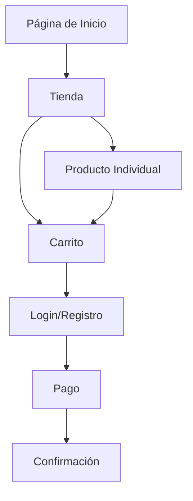

## 1. Product Overview
Perfumeria Aero es una tienda online especializada en perfumes y fragancias de alta calidad. Ofrecemos una experiencia de compra elegante y sofisticada con productos premium para clientes que buscan fragancias únicas.

Nuestra plataforma permite a los usuarios explorar, descubrir y comprar perfumes con facilidad, proporcionando una experiencia de usuario fluida desde la navegación hasta el pago seguro.

## 2. Core Features

### 2.1 User Roles
| Rol | Método de Registro | Permisos Principales |
|------|---------------------|------------------|
| Cliente | Registro por email | Navegar productos, comprar, guardar favoritos, ver historial de pedidos |
| Visitante | Sin registro | Navegar productos, agregar al carrito (requiere registro para completar compra) |

### 2.2 Feature Module
Nuestra tienda de perfumería consiste en las siguientes páginas principales:
1. **Página de Inicio**: sección hero, categorías de productos, productos destacados, bestsellers, boletín informativo.
2. **Tienda**: catálogo completo de productos, filtros por categoría/precio/marca, ordenamiento.
3. **Carrito de Compras**: resumen de productos, modificación de cantidades, cálculo de total.
4. **Pago**: formulario de pago seguro, datos de envío, confirmación de pedido.
5. **Registro/Login**: formularios de autenticación para clientes nuevos y existentes.

### 2.3 Page Details
| Page Name | Module Name | Feature description |
|-----------|-------------|---------------------|
| Página de Inicio | Hero section | Mostrar imagen de perfume con título "Fragancias que Cuentan Tu Historia", subtítulo promocional, botón "Comprar Ahora" en burgundy |
| Página de Inicio | Categorías | Mostrar tiles circulares con imágenes de categorías: Mujer, Hombre, Unisex, Novedades |
| Página de Inicio | Productos Destacados | Grid de 6 productos con badges "NUEVO"/"OFERTA", nombre del perfume, precio, botones "Agregar al Carrito" y "Vista Rápida" |
| Página de Inicio | Bestsellers | Grid de productos más vendidos con mismo formato que destacados |
| Página de Inicio | Newsletter | Formulario de suscripción con campo de email y botón "Suscribirse" |
| Tienda | Catálogo | Grid de todos los productos con filtros laterales por precio, categoría, marca |
| Tienda | Filtros | Sidebar con opciones de filtrado: rango de precio, categoría, marca, ordenar por precio/nombre/novedad |
| Carrito | Resumen de Productos | Lista de productos agregados con imagen, nombre, precio unitario, cantidad editable, subtotal |
| Carrito | Total y Checkout | Mostrar total calculado, botón "Proceder al Pago", opción de seguir comprando |
| Pago | Formulario de Pago | Campos para datos de tarjeta (número, fecha, CVV), datos de facturación y envío |
| Pago | Confirmación | Resumen del pedido, dirección de envío, método de pago seleccionado |
| Registro/Login | Formulario Registro | Campos: nombre completo, email, contraseña, confirmar contraseña |
| Registro/Login | Formulario Login | Campos: email, contraseña, opción de recordar sesión |

## 3. Core Process
### Flujo de Compra para Cliente:
1. Usuario navega por la página de inicio o tienda
2. Explora productos y los agrega al carrito
3. Accede al carrito para revisar su selección
4. Si no está registrado, debe crear cuenta o iniciar sesión
5. Completa el formulario de pago con datos de envío y pago
6. Recibe confirmación del pedido

### Flujo de Navegación General:
- Usuario puede navegar libremente por todas las páginas
- El carrito se mantiene durante la sesión
- Requiere autenticación solo para finalizar compra

## 4. User Interface Design
### 4.1 Design Style
- **Colores principales**: Burgundy oscuro (#7B1C1C), Crema (#F5E6D3), Beige claro (#F9F4E9), Dorado (#D4AF37) para acentos
- **Colores secundarios**: Blanco para fondos, Gris oscuro (#333333) para texto
- **Botones**: Estilo redondeado con fondo burgundy y texto blanco, hover effect con transición suave
- **Tipografía**: Headings en serif (Playfair Display), body text en sans-serif (Open Sans)
- **Layout**: Card-based design con sombras sutiles, navegación superior fija
- **Iconos**: Estilo minimalista en línea, color burgundy para consistencia

### 4.2 Page Design Overview
| Page Name | Module Name | UI Elements |
|-----------|-------------|-------------|
| Página de Inicio | Hero section | Imagen de fondo con perfume, overlay oscuro 50%, título serif 48px blanco, subtítulo 18px blanco, botón burgundy redondeado |
| Página de Inicio | Categorías | Tiles circulares 120px con borde dorado, imágenes centradas, títulos sans-serif 14px debajo |
| Página de Inicio | Productos Grid | Cards con sombra box-shadow, imágenes 300x300px, badges en esquina superior derecha, precios en burgundy bold |
| Carrito | Items List | Tabla responsive con imágenes 80x80px, cantidad con input numérico, botones de eliminar en rojo |
| Pago | Payment Form | Formulario multi-step con validación en tiempo real, campos con bordes redondeados, botón principal prominente |

### 4.3 Responsiveness
- Diseño desktop-first con breakpoints adaptativos
- Mobile: menú hamburguesa, productos en columna única, carrito simplificado
- Tablet: grid de 2 columnas para productos, sidebar colapsable para filtros
- Touch optimization: botones mínimo 44px, swipe para carrusel de imágenes