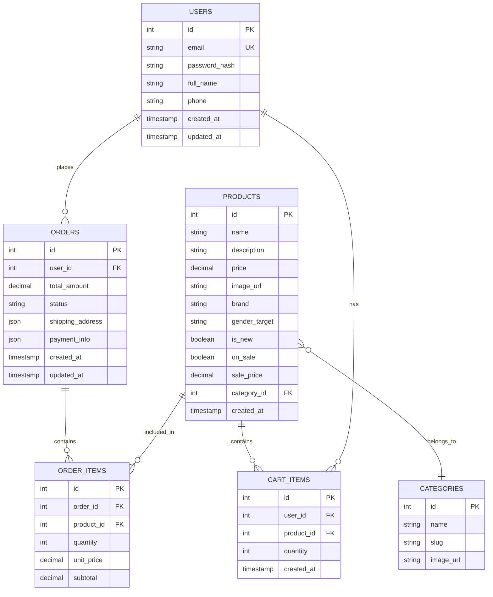

## 1. Architecture design

```mermaid
graph TD
  A[User Browser] --> B[React Frontend Application]
  B --> C[Node.js/Express API]
  C --> D[MySQL Database]
  C --> E[Local/Cloud Storage (Images)]

  subgraph "Frontend Layer"
      B
  end

  subgraph "Backend Layer"
      C
      D
      E
  end
```

## 2. Technology Description
- Frontend: React@18 + tailwindcss@3 + vite
- Initialization Tool: vite-init
- Backend: Node.js + Express
- Database: MySQL
- ORM/Query Builder: Sequelize or MySQL2 (Direct)
- Payment: Stripe integration (client-side + backend verification)

## 3. Route definitions
| Route | Purpose |
|-------|---------|
| / | Home page, displays hero section and featured products |
| /tienda | Shop page, shows all products with filters |
| /carrito | Shopping cart, displays added products |
| /pago | Checkout page with payment form |
| /login | Login page for existing customers |
| /registro | Registration page for new customers |
| /perfil | User profile page with order history |

## 4. API definitions
### 4.1 Core API

**Authentication**
- `POST /api/auth/register` - Register new user
- `POST /api/auth/login` - Login user
- `GET /api/auth/me` - Get current user info

**Products**
- `GET /api/products` - List all products (with filters)
- `GET /api/products/:id` - Get single product details
- `GET /api/categories` - List categories

**Orders**
- `POST /api/orders` - Create new order
- `GET /api/orders/my-orders` - Get user's orders

## 5. Server architecture diagram
Node.js Express Server running on port 3000 (proxy from Vite dev server).

## 6. Data model

### 6.1 Data model definition


### 6.2 Data Definition Language (MySQL)

**Users Table (users)**
```sql
CREATE TABLE users (
    id INT AUTO_INCREMENT PRIMARY KEY,
    email VARCHAR(255) UNIQUE NOT NULL,
    password_hash VARCHAR(255) NOT NULL,
    full_name VARCHAR(100) NOT NULL,
    phone VARCHAR(20),
    created_at TIMESTAMP DEFAULT CURRENT_TIMESTAMP,
    updated_at TIMESTAMP DEFAULT CURRENT_TIMESTAMP ON UPDATE CURRENT_TIMESTAMP
);
```

**Categories Table (categories)**
```sql
CREATE TABLE categories (
    id INT AUTO_INCREMENT PRIMARY KEY,
    name VARCHAR(100) NOT NULL,
    slug VARCHAR(100) UNIQUE NOT NULL,
    image_url VARCHAR(500),
    created_at TIMESTAMP DEFAULT CURRENT_TIMESTAMP
);

INSERT INTO categories (name, slug) VALUES 
('Mujer', 'mujer'),
('Hombre', 'hombre'),
('Unisex', 'unisex'),
('Novedades', 'novedades');
```

**Products Table (products)**
```sql
CREATE TABLE products (
    id INT AUTO_INCREMENT PRIMARY KEY,
    name VARCHAR(255) NOT NULL,
    description TEXT,
    price DECIMAL(10,2) NOT NULL,
    image_url VARCHAR(500),
    brand VARCHAR(100),
    gender_target ENUM('women', 'men', 'unisex'),
    is_new BOOLEAN DEFAULT false,
    on_sale BOOLEAN DEFAULT false,
    sale_price DECIMAL(10,2),
    category_id INT,
    created_at TIMESTAMP DEFAULT CURRENT_TIMESTAMP,
    FOREIGN KEY (category_id) REFERENCES categories(id)
);
```

**Orders Table (orders)**
```sql
CREATE TABLE orders (
    id INT AUTO_INCREMENT PRIMARY KEY,
    user_id INT,
    total_amount DECIMAL(10,2) NOT NULL,
    status ENUM('pending', 'processing', 'shipped', 'delivered', 'cancelled') DEFAULT 'pending',
    shipping_address JSON NOT NULL,
    payment_info JSON,
    created_at TIMESTAMP DEFAULT CURRENT_TIMESTAMP,
    updated_at TIMESTAMP DEFAULT CURRENT_TIMESTAMP ON UPDATE CURRENT_TIMESTAMP,
    FOREIGN KEY (user_id) REFERENCES users(id)
);
```

**Order Items Table (order_items)**
```sql
CREATE TABLE order_items (
    id INT AUTO_INCREMENT PRIMARY KEY,
    order_id INT,
    product_id INT,
    quantity INT NOT NULL,
    unit_price DECIMAL(10,2) NOT NULL,
    subtotal DECIMAL(10,2) NOT NULL,
    FOREIGN KEY (order_id) REFERENCES orders(id),
    FOREIGN KEY (product_id) REFERENCES products(id)
);
```
